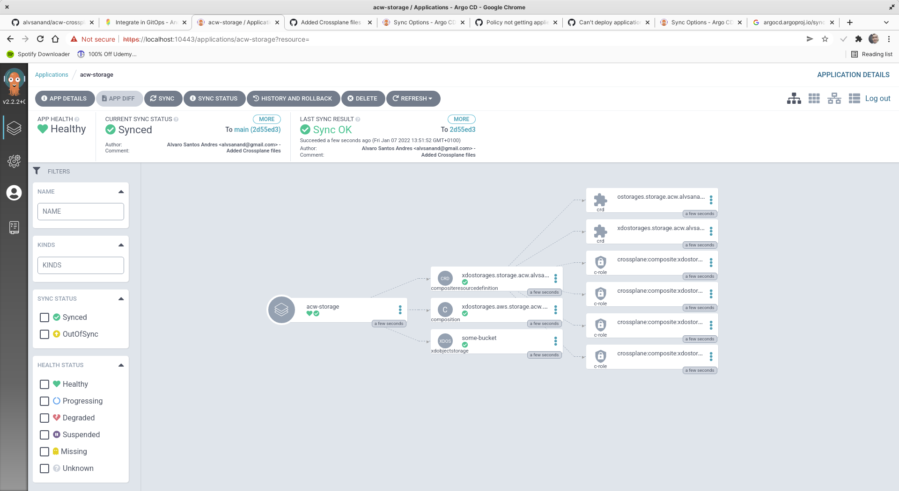

---
hide:
  - navigation
---
# Integrate in GitOps

GitOps is a set of practices to manage infrastructure and application configurations using Git, an open source version control system. GitOps works by using Git as a single source of truth for declarative infrastructure and applications. The Git repository contains the entire state of the system so that the trail of changes to the system state are visible and auditable.

Using GitOps tool such as Argo CD or Flux CD, we will be able to make our target system match the desired state that is coded in the Git repository. So when we will deploy new resources or update an existing ones, after updating the repository the automated process will apply the changes.

In the last laboratory, we will apply this concepts to our infrastructure using Crossplane and [Argo CD](https://argo-cd.readthedocs.io/en/stable/).

!!! note
    If you want to know more about Gitops and Argo CD, please read my article [From GIT to Kubernetes in 10 minutes with ArgoCD](https://santanderglobaltech.com/en/from-git-to-kubernetes-in-10-minutes-with-argocd/).

## 01. Creating the IaC repository

As said before a Git will be the single source of truth for our infrastructure and will contain the entire state and history of it so that the trail of changes to the system state are visible and auditable.

### Create a Github repository

First thing to do is to create a Git repository that we will use to store the Crosplanes files.

```bash
gh repo create --public acw-crossplane-with-argocd --clone --gitignore Python

cd acw-crossplane-with-argocd
```

### Add Crossplane files

Now, we have to create the Crosplanes files but for now we will not commit them.

!!! note
    In this case, we have to add ```argocd.argoproj.io/sync-wave``` and ```argocd.argoproj.io/sync-options``` annotations that will indicate ArgoCD the order of execution so claim must execute only after XD resources are created. See [Sync Phases and Waves](https://argo-cd.readthedocs.io/en/stable/user-guide/sync-waves/) and [Skip Dry Run for new custom resources types](https://argo-cd.readthedocs.io/en/stable/user-guide/sync-options/#skip-dry-run-for-new-custom-resources-types) for more information.

- Create a ```CompositeResourceDefinition``` file.

    ```bash
    cat > 1_definition.yaml <<EOF
    apiVersion: apiextensions.crossplane.io/v1
    kind: CompositeResourceDefinition
    metadata:
        name: xdostorages.storage.acw.alvsanand.github.io
        annotations:
            argocd.argoproj.io/sync-wave: "1"
    spec:
        group: storage.acw.alvsanand.github.io
        names:
            kind: XDObjectStorage
            plural: xdostorages
        claimNames:
            kind: ObjectStorage
            plural: ostorages
        versions:
            - name: v1alpha1
              served: true
              referenceable: true
              schema:
                  openAPIV3Schema:
                      type: object
                      properties:
                          spec:
                              type: object
                              properties:
                                  parameters:
                                      type: object
                                      properties:
                                          storageName:
                                              type: string
                                      required:
                                          - storageName
                              required:
                                  - parameters
    EOF
    ```

- Create a ```Composition``` file.

    ```bash
    cat > 1_composition.yaml <<EOF
    apiVersion: apiextensions.crossplane.io/v1
    kind: Composition
    metadata:
        name: xdostorages.aws.storage.acw.alvsanand.github.io
        labels:
            serviceType: storage
            provider: aws
        annotations:
            argocd.argoproj.io/sync-wave: "1"
    spec:
        compositeTypeRef:
            apiVersion: storage.acw.alvsanand.github.io/v1alpha1
            kind: XDObjectStorage
        resources:
            - name: s3bucket
              base:
                  apiVersion: s3.aws.crossplane.io/v1beta1
                  kind: Bucket
                  spec:
                      forProvider:
                          acl: public-read-write
                          locationConstraint: us-east-1
                      providerConfigRef:
                          name: default
              patches:
                  - fromFieldPath: "spec.parameters.storageName"
                    toFieldPath: "metadata.name"
                    transforms:
                        - type: string
                          string:
                              fmt: "%s-acw"
    EOF
    ```

- Create a ```Claim``` file.

    ```bash
    cat > 2_claim.yaml <<EOF
    apiVersion: storage.acw.alvsanand.github.io/v1alpha1
    kind: XDObjectStorage
    metadata:
        name: some-bucket
        namespace: default
        annotations:
            argocd.argoproj.io/sync-wave: "2"
            argocd.argoproj.io/sync-options: SkipDryRunOnMissingResource=true
    spec:
        compositionSelector:
            matchLabels:
                provider: aws
        parameters:
            storageName: some-bucket
    EOF
    ```

## 02. Create an App in ArgoCD

Now that we have a repository, we have to create an [Application](https://argo-cd.readthedocs.io/en/stable/operator-manual/declarative-setup/#applications) in ArgoCD so Crossplane resources will be deployed automatically.

- Obtain HTTPS url of the GIT repository.

    ```bash
    HTTPS_REPO_URL=$(git remote show origin |  sed -nr 's/.+Fetch URL: git@(.+):(.+).git/https:\/\/\1\/\2.git/p')
    ```

- Create a new Application in auto mode and listening to the master.

    ```bash
    cat <<EOF | kubectl apply -f -
    apiVersion: argoproj.io/v1alpha1
    kind: Application
    metadata:
      name: acw-storage
      namespace: argocd
    spec:
      project: default
      source:
        repoURL: $HTTPS_REPO_URL
        targetRevision: main
        path: .
      destination:
        server: https://kubernetes.default.svc
        namespace: another-crossplane-workshop
      syncPolicy:
        automated: {}
    EOF
    ```

- Wait until the application is sync.

    ```bash
    kubectl get applications -n argocd acw-storage

    ...    
    NAME          SYNC STATUS   HEALTH STATUS
    acw-storage   Synced        Healthy
    ```

- Furthermore, you can check in [ArgoCD UI](https://localhost:10443/applications/acw-storage?resource=&conditions=false) the status of the application.


## 03. Commit changes to Git

After ArgoCD is ready to watch for changes, we will push the files to the repo in order to force the deployment.

- Add files and generate a commit.

    ```bash
    git add *.yaml
    git commit -m "Added Crossplane files"
    ```

- Push changes to Github.

    ```bash
    git push --set-upstream origin main
    ```

- Wait some minutes until the application is sync again.

    ```bash
    kubectl describe applications -n argocd acw-storage

    ...    
    Name:         acw-storage
    Namespace:    argocd
    Labels:       <none>
    Annotations:  <none>
    API Version:  argoproj.io/v1alpha1
    Kind:         Application
    Metadata:
      Creation Timestamp:  2022-01-07T12:51:44Z
      Generation:          12
      Managed Fields:
        API Version:  argoproj.io/v1alpha1
        Fields Type:  FieldsV1
        fieldsV1:
          f:metadata:
            f:annotations:
              .:
              f:kubectl.kubernetes.io/last-applied-configuration:
          f:spec:
            .:
            f:destination:
              .:
              f:namespace:
              f:server:
            f:project:
            f:source:
              .:
              f:path:
              f:repoURL:
              f:targetRevision:
            f:syncPolicy:
              .:
              f:automated:
        Manager:      kubectl-client-side-apply
        Operation:    Update
        Time:         2022-01-07T12:51:44Z
        API Version:  argoproj.io/v1alpha1
        Fields Type:  FieldsV1
        fieldsV1:
          f:status:
            .:
            f:health:
              .:
              f:status:
            f:history:
            f:operationState:
              .:
              f:finishedAt:
              f:message:
              f:operation:
                .:
                f:initiatedBy:
                  .:
                  f:automated:
                f:retry:
                  .:
                  f:limit:
                f:sync:
                  .:
                  f:revision:
              f:phase:
              f:startedAt:
              f:syncResult:
                .:
                f:resources:
                f:revision:
                f:source:
                  .:
                  f:path:
                  f:repoURL:
                  f:targetRevision:
            f:reconciledAt:
            f:resources:
            f:sourceType:
            f:summary:
            f:sync:
              .:
              f:comparedTo:
                .:
                f:destination:
                  .:
                  f:namespace:
                  f:server:
                f:source:
                  .:
                  f:path:
                  f:repoURL:
                  f:targetRevision:
              f:revision:
              f:status:
        Manager:         argocd-application-controller
        Operation:       Update
        Time:            2022-01-07T12:51:52Z
      Resource Version:  27693
      UID:               24016e22-b199-4ed4-9f2b-6ce96018f798
    Spec:
      Destination:
        Namespace:  another-crossplane-workshop
        Server:     https://kubernetes.default.svc
      Project:      default
      Source:
        Path:             .
        Repo URL:         https://github.com/alvsanand/acw-crossplane-with-argocd.git
        Target Revision:  main
      Sync Policy:
        Automated:
    Status:
      Health:
        Status:  Healthy
      History:
        Deploy Started At:  2022-01-07T12:51:45Z
        Deployed At:        2022-01-07T12:51:52Z
        Id:                 0
        Revision:           2d55ed389750624c21bce8c2d534f4b77d72f837
        Source:
          Path:             .
          Repo URL:         https://github.com/alvsanand/acw-crossplane-with-argocd.git
          Target Revision:  main
      Operation State:
        Finished At:  2022-01-07T12:51:52Z
        Message:      successfully synced (all tasks run)
        Operation:
          Initiated By:
            Automated:  true
          Retry:
            Limit:  5
          Sync:
            Revision:  2d55ed389750624c21bce8c2d534f4b77d72f837
        Phase:         Succeeded
        Started At:    2022-01-07T12:51:45Z
        Sync Result:
          Resources:
            Group:       apiextensions.crossplane.io
            Hook Phase:  Succeeded
            Kind:        Composition
            Message:     composition.apiextensions.crossplane.io/xdostorages.aws.storage.acw.alvsanand.github.io created
            Name:        xdostorages.aws.storage.acw.alvsanand.github.io
            Namespace:   another-crossplane-workshop
            Status:      Synced
            Sync Phase:  Sync
            Version:     v1
            Group:       apiextensions.crossplane.io
            Hook Phase:  Succeeded
            Kind:        CompositeResourceDefinition
            Message:     compositeresourcedefinition.apiextensions.crossplane.io/xdostorages.storage.acw.alvsanand.github.io created
            Name:        xdostorages.storage.acw.alvsanand.github.io
            Namespace:   another-crossplane-workshop
            Status:      Synced
            Sync Phase:  Sync
            Version:     v1
            Group:       storage.acw.alvsanand.github.io
            Hook Phase:  Running
            Kind:        XDObjectStorage
            Message:     xdobjectstorage.storage.acw.alvsanand.github.io/some-bucket created
            Name:        some-bucket
            Namespace:   another-crossplane-workshop
            Status:      Synced
            Sync Phase:  Sync
            Version:     v1alpha1
          Revision:      2d55ed389750624c21bce8c2d534f4b77d72f837
          Source:
            Path:             .
            Repo URL:         https://github.com/alvsanand/acw-crossplane-with-argocd.git
            Target Revision:  main
      Reconciled At:          2022-01-07T12:51:52Z
      Resources:
        Group:      apiextensions.crossplane.io
        Kind:       CompositeResourceDefinition
        Name:       xdostorages.storage.acw.alvsanand.github.io
        Status:     Synced
        Version:    v1
        Group:      apiextensions.crossplane.io
        Kind:       Composition
        Name:       xdostorages.aws.storage.acw.alvsanand.github.io
        Status:     Synced
        Version:    v1
        Group:      storage.acw.alvsanand.github.io
        Kind:       XDObjectStorage
        Name:       some-bucket
        Status:     Synced
        Version:    v1alpha1
      Source Type:  Directory
      Summary:
      Sync:
        Compared To:
          Destination:
            Namespace:  another-crossplane-workshop
            Server:     https://kubernetes.default.svc
          Source:
            Path:             .
            Repo URL:         https://github.com/alvsanand/acw-crossplane-with-argocd.git
            Target Revision:  main
        Revision:             2d55ed389750624c21bce8c2d534f4b77d72f837
        Status:               Synced
    Events:
      Type    Reason              Age    From                           Message
      ----    ------              ----   ----                           -------
      Normal  OperationStarted    4m34s  argocd-application-controller  Initiated automated sync to '2d55ed389750624c21bce8c2d534f4b77d72f837'
      Normal  ResourceUpdated     4m34s  argocd-application-controller  Updated sync status:  -> OutOfSync
      Normal  ResourceUpdated     4m34s  argocd-application-controller  Updated health status:  -> Healthy
      Normal  ResourceUpdated     4m33s  argocd-application-controller  Updated sync status:  -> OutOfSync
      Normal  ResourceUpdated     4m33s  argocd-application-controller  Updated health status:  -> Healthy
      Normal  OperationCompleted  4m27s  argocd-application-controller  Sync operation to 2d55ed389750624c21bce8c2d534f4b77d72f837 succeeded
      Normal  ResourceUpdated     4m27s  argocd-application-controller  Updated sync status: OutOfSync -> Synced
    ```

- Again, you can check in [ArgoCD UI](https://localhost:10443/applications/acw-storage?resource=&conditions=false) the status of the application.



- Check that the xdostorages is created.

    ```bash
    kubectl get xdostorages

    ...
    NAME          READY   COMPOSITION                                       AGE
    some-bucket   True    xdostorages.aws.storage.acw.alvsanand.github.io   89s
    ```

- Check that the bucket object is created.

    ```bash
    kubectl get bucket

    ...
    NAME              READY   SYNCED   AGE
    some-bucket-acw   True    True     113s
    ```

- Check that the bucket has been created in localstack.

    ```bash
    awslocal s3api list-buckets

    ...
    {
        "Buckets": [
            {
                "Name": "some-bucket-acw",
                "CreationDate": "2022-01-06T08:05:16.000Z"
            }
        ],
        "Owner": {
            "DisplayName": "webfile",
            "ID": "bcaf1ffd86f41161ca5fb16fd081034f"
        }
    }
    ```

### Cleanup the Composition

Last step, delete all resources created. We must only delete the ArgoCD app

- Delete all the resources.

    ```bash
    kubectl delete application -n argocd acw-storage
    ```

- Check that the bucket has been created in localstack.

    ```bash
    awslocal s3api list-buckets

    ...
    {
        "Buckets": [],
        "Owner": {
            "DisplayName": "webfile",
            "ID": "bcaf1ffd86f41161ca5fb16fd081034f"
        }
    }
    ```
