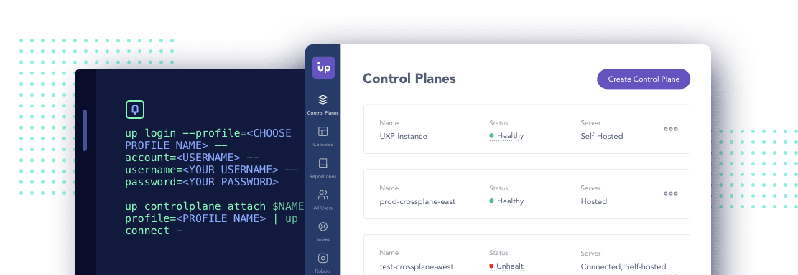

---
hide:
  - navigation
---
# Overview

## 1. What is Crossplane?

[Crossplane](https://crossplane.io/) is an open source [Cloud Native Compute Foundation](https://www.cncf.io/) project that transforms a [Kubernetes](https://kubernetes.io/) cluster into a universal control plane. With the help of Crossplane, you will be able to assemble infrastructure from multiple vendors, and expose higher level self-service APIs for application teams to consume, without having to write any code.

Crossplane introduces multiple building blocks that enable you to provision, compose, and consume infrastructure using the Kubernetes API. These individual concepts work together to allow for powerful separation of concern between different personas in an organization, meaning that each member of a team interacts with Crossplane at an appropriate level of abstraction.

## 2. Concepts

You must know at least the following concepts:

- Packages
- Providers
- Managed Resources
- Composite Resources
- Composite Resources Claim

### 2.1. Packages

Packages allow Crossplane to be extended to include new functionality. This typically looks like bundling a set of Kubernetes CRDs and controllers that represent and manage external infrastructure (i.e. a provider), then installing them into a cluster where Crossplane is running. Crossplane handles making sure any new CRDs do not conflict with existing ones, as well as manages the RBAC and security of new packages. Packages are not strictly required to be providers, but it is the most common use-case for packages at this time.

### 2.2. Providers

Providers are packages that enable Crossplane to provision infrastructure on an external service. They bring CRDs (i.e. managed resources) that map one-to-one to external infrastructure resources, as well as controllers to manage the life-cycle of those resources.

There most prominent providers are:

- [provider-alibaba](https://github.com/crossplane/provider-alibaba)
- [provider-aws](https://github.com/crossplane/provider-aws)
- [provider-azure](https://github.com/crossplane/provider-azure)
- [provider-gcp](https://github.com/crossplane/provider-gcp)
- [provider-rook](https://github.com/crossplane/provider-rook)
- [provider-helm](https://github.com/crossplane/provider-helm)

Furthermore, there are many others supported mainly by the community known as [crossplane-contrib](https://github.com/crossplane-contrib)

### 2.3. Managed Resources

Managed resources are Kubernetes custom resources that represent infrastructure primitives. Managed resources with an API version of v1beta1 or higher support every field that the cloud provider does for the given resource.

### 2.4. Composite Resources

A composite resource (XR) is a special kind of custom resource that is defined by a CompositeResourceDefinition. It composes one or more managed resources into a higher level infrastructure unit. Composite resources are infrastructure operator facing, but may optionally offer an application developer facing composite resource claim that acts as a proxy for a composite resource.

### 2.5. Composite Resource Claim

A "Composite Resource Claim", "XRC", or just "a claim" is also an API type defined using Crossplane. Each type of claim corresponds to a type of composite resource, and the pair have nearly identical schemas. Like composite resources, the type of a claim is arbitrary.

### 2.6. Where the State Goes?

Just like Terraform Crossplane tracks the state of your resources as custom Kubernetes resources and can reconcile them if necessary. So, the state of your infra is stored in the ETCD of your cluster. Which might be a bit worrisome. Especially, if you treat your clusters like cattle, spin up new and bring down old clusters regularly. It would be also a concern if one day you want to make a ship-and-lift migration to the new cluster.

## 3. Why should we use Crossplane?

Crossplane will enable us a lot of possibilities:

- Provide an option to DevOps to define abstract infrastructure types and templates that map to them. That will reduce the cost of maintenance but at the same time increase the security and compliance of our systems.
- Create a infrastructure marketplace, so teams will have fast access to the infra without any help and manual intervention.
- Use the same language (Kubernetes API style) for everything, we can describes everything needed to run an application, from deployment to infrastructure requirements (databases, queues, …).
- Integrate with the same GitOps tools such as [Argo CD](https://argo-cd.readthedocs.io/en/stable/), [Github Actions](https://docs.github.com/es/actions) or [Jenkins](https://www.jenkins.io/).
- As Crossplane is a Kubernetes operator, it has reconciliation built into its heart and therefore all the time actively makes sure that the infrastructure adheres to the defined state.

## 4. Commercial Support

{ align=left }

[Upbound](https://www.upbound.io/) is the company behind Crossplane. Upbound’s product offerings are available via a subscription model that currently has two tiers. The first is a free tier catering to individuals getting started with control planes and who need tooling to debug and share their Crossplane providers and configurations.

It includes full access to Universal Crossplane (UXP), the ability to publish public listings in Upbound Registry, and limited access to Upbound Cloud. Upbound’s enterprise tier unlocks additional value across the product portfolio. Platform teams can manage unlimited control planes in Upbound Cloud, create unlimited private listings in Upbound Registry, and get access to 24/7 support, prioritized bug fixes, implementation services, onboarding and training.

